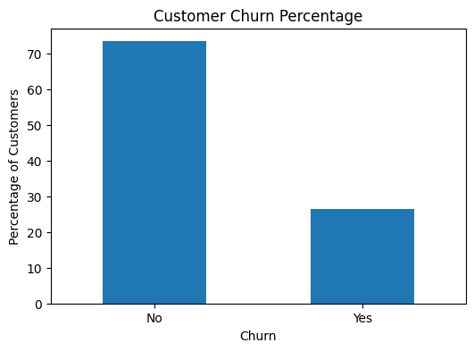
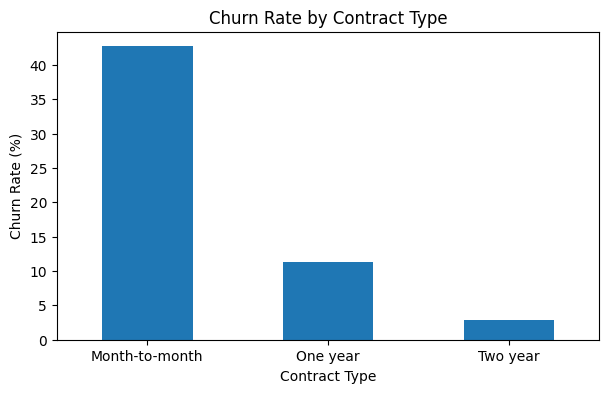
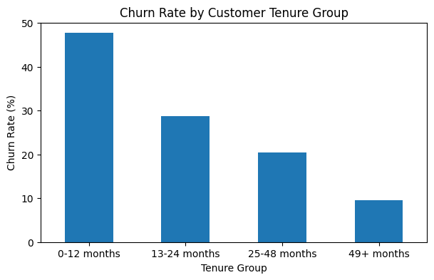
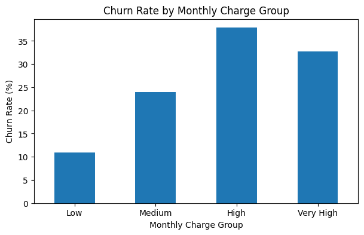
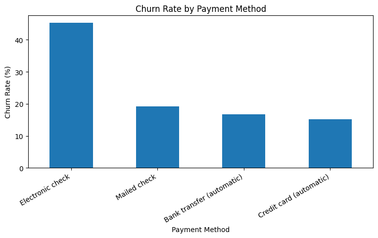
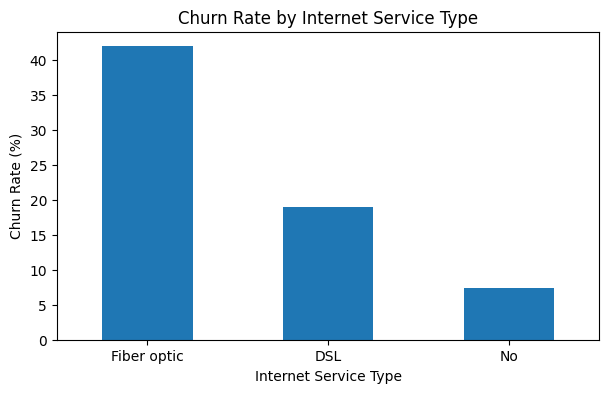
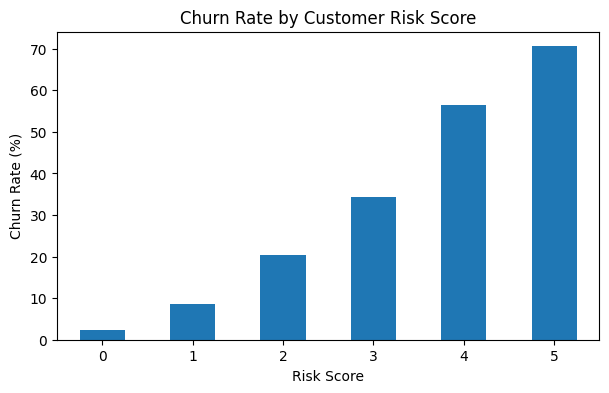

# Customer Churn and Retention Analysis

## Project Overview

This project analyzes customer churn patterns for a telecom company. Customer churn occurs when customers stop using a company’s service. High churn can reduce revenue, increase customer acquisition costs, and weaken long-term business growth.

The goal of this project is to identify which customer groups are more likely to leave and provide business recommendations that can help improve customer retention.

## Business Problem

The company wants to understand why customers are leaving and which customer segments should be prioritized for retention efforts.

This analysis focuses on answering the following questions:

- What is the overall churn rate?
- Which contract types have the highest churn?
- Are newer customers more likely to churn?
- Do monthly charges affect churn?
- Which payment methods are linked with higher churn?
- Which internet service types have higher churn?
- Can high-risk customers be identified using multiple churn factors?

## Dataset

The dataset used for this project is the Telco Customer Churn dataset. It contains customer information such as demographics, service subscriptions, billing details, contract type, payment method, tenure, and churn status.

The cleaned dataset contains:

- 7,032 customers
- 21 original columns
- Additional columns created for segmentation and risk scoring

## Tools Used

- Python
- Pandas
- NumPy
- Matplotlib
- Jupyter Notebook
- Power BI, planned for dashboard development

## Data Cleaning

The main cleaning steps included:

- Converted `TotalCharges` from text/object format into numeric format.
- Removed rows where `TotalCharges` was missing.
- Converted `SeniorCitizen` from 0/1 values into readable Yes/No labels.
- Checked for missing values and duplicate records.
- Created customer segments for tenure and monthly charges.

After cleaning, the dataset contained 7,032 rows and 21 original columns.

## Key Findings

### 1. Overall Churn Rate

The overall churn rate was **26.58%**.

This means roughly one out of every four customers left the company.

### 2. Churn by Contract Type

Contract type showed a strong relationship with churn.

- Month-to-month churn rate: **42.71%**
- One-year churn rate: **11.28%**
- Two-year churn rate: **2.85%**

Customers with month-to-month contracts were much more likely to leave than customers with longer contracts.

### 3. Churn by Customer Tenure

Newer customers had much higher churn rates than long-term customers.

- 0–12 months churn rate: **47.68%**
- 13–24 months churn rate: **28.71%**
- 25–48 months churn rate: **20.39%**
- 49+ months churn rate: **9.51%**

This shows that the first year of the customer relationship is critical for retention.

### 4. Churn by Monthly Charges

Customers with higher monthly charges showed higher churn rates.

- Low monthly charge churn: **10.93%**
- Medium monthly charge churn: **23.98%**
- High monthly charge churn: **37.84%**
- Very high monthly charge churn: **32.78%**

This suggests that pricing, service quality, or perceived value may influence churn.

### 5. Churn by Payment Method

Payment method also showed a strong churn pattern.

- Electronic check churn: **45.29%**
- Mailed check churn: **19.20%**
- Bank transfer automatic churn: **16.73%**
- Credit card automatic churn: **15.25%**

Customers using electronic checks had the highest churn rate.

### 6. Churn by Internet Service Type

Internet service type was another important churn driver.

- Fiber optic churn: **41.89%**
- DSL churn: **19.00%**
- No internet service churn: **7.43%**

Fiber optic customers had much higher churn than DSL customers and customers without internet service.

### 7. High-Risk Customer Segment Analysis

A customer risk score was created using five churn risk factors:

- Month-to-month contract
- Tenure of 12 months or less
- Electronic check payment method
- Fiber optic internet service
- High or very high monthly charges

The churn rate increased clearly as the risk score increased.

- Risk score 0 churn rate: **2.27%**
- Risk score 1 churn rate: **8.70%**
- Risk score 2 churn rate: **20.49%**
- Risk score 3 churn rate: **34.37%**
- Risk score 4 churn rate: **56.53%**
- Risk score 5 churn rate: **70.58%**

This shows that customers with multiple risk factors are much more likely to leave.

## Business Recommendations

### 1. Prioritize Month-to-Month Customers

Month-to-month customers have the highest churn rate. The company should target these customers with loyalty discounts, contract upgrade offers, or bundled service benefits.

### 2. Improve First-Year Customer Retention

Customers in their first 12 months are much more likely to churn. The company should improve onboarding, provide early customer support, and check in with new customers during the first few months.

### 3. Monitor High Monthly Charge Customers

Customers with high monthly charges are more likely to leave. The company should review whether these customers feel they are receiving enough value for the price they pay.

### 4. Investigate Fiber Optic Churn

Fiber optic customers have a high churn rate. The company should investigate whether this is caused by pricing, service reliability, competition, or unmet expectations.

### 5. Encourage Automatic Payment Methods

Electronic check users have the highest churn rate among payment groups. The company could encourage customers to switch to automatic payment methods by offering convenience benefits or small discounts.

### 6. Use Risk Scores for Targeted Retention

Customers with risk scores of 4 or 5 should be treated as high-priority retention targets. This score can help the company focus retention campaigns on the customers most likely to leave.

## Conclusion

This project analyzed customer churn patterns using customer demographics, contract details, billing information, service usage, and payment methods.

The overall churn rate was **26.58%**. Churn was strongly linked with contract type, customer tenure, monthly charges, payment method, and internet service type.

The analysis found that the highest-risk customers are those who are newer, on month-to-month contracts, using electronic checks, subscribed to fiber optic internet, and paying higher monthly charges.

By using these findings, the company can move from general retention efforts to targeted customer retention strategies.